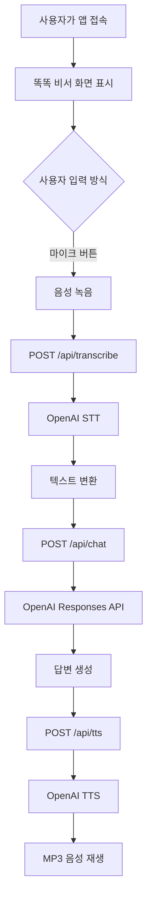

# 똑똑 비서

## 인공지능 기초로 만드는 건강과 웰빙 애플리케이션

### 이 책을 읽기 전에

이 책은 고등학교 인공지능 기초 교과목 4단원을 주제로 유엔 지속가능발전목표(SDGs) **목표 3: 건강과 웰빙**을 우리 힘으로 실현해 보는 프로젝트형 교과서입니다.  초고령화사회에서는 몸의 건강뿐 아니라 대화, 기억, 집중과 같은 일상적인 인지활동도 중요합니다. `똑똑 비서`는 전문 의료진을 대신하지 않지만, 어르신들이 즐겁게 '끝말잇기' 게임을 즐기며 뇌 운동을 하고, 동시에 매일의 건강 상태도 체크할 수 있는 웹 애플리케이션을 직접 만드는 과정을 담았습니다

프로그래밍을 처음 시작하는 학생도 겁먹지 않고 따라올 수 있도록 눈높이를 낮췄습니다. 웹 브라우저와 서버가 서로 어떻게 대화를 나누는지(웹의 동작 방식), 인공지능 기능과 외부 서비스를 어떻게 API 형태로 가져와 연동하는지, 친근한 비유와 직관적인 단계별 설명으로 쉽게 풀어냅니다.

> 중요한 안내: 이 프로그램은 교육용 건강관리 보조 애플리케이션입니다. 진단이나 처방을 하지 않습니다. 심한 흉통, 호흡곤란, 의식저하 등 응급 증상이 있으면 프로그램의 답변을 기다리지 말고 즉시 119 또는 의료기관에 도움을 요청해야 합니다.

> 중요한 안내: 이 프로그램은 교육용 건강관리 보조 애플리케이션입니다. 진단이나 처방을 하지 않습니다. 심한 흉통, 호흡곤란, 의식저하 등 응급 증상이 있으면 프로그램의 답변을 기다리지 말고 즉시 119 또는 의료기관에 도움을 요청해야 합니다.

## 목차

1. 우리가 만들 문제와 해결 방법
2. 프로그램 전체 구조
3. 웹 브라우저는 어떻게 동작할까
4. 음성으로 대화하는 과정
5. 네 가지 API 배우기
6. 끝말잇기와 MCP
7. 소스코드 읽는 법
8. 실행하고 테스트하기
9. 환경 변수와 보안
10. 직접 해 보는 탐구 활동

## 1. 우리가 만들 문제와 해결 방법

### 문제 상황

초고령화사회에서는 어르신이 건강 상태를 표현하거나, 혼자서 인지활동을 꾸준히 하기 어려울 수 있습니다. 버튼과 글자를 많이 사용해야 하는 앱은 불편할 수도 있습니다.

### 해결 아이디어

`똑똑 비서`는 다음 순서로 사용합니다.

1. 사용자가 마이크 버튼을 누릅니다.
2. 건강 상태나 게임 의도를 말합니다.
3. 음성이 글자로 바뀝니다.
4. 인공지능이 질문을 이해하고 답변을 만듭니다.
5. 끝말잇기라면 MCP 게임 도구를 사용합니다.
6. 답변을 화면에 보여주고 음성으로 읽어줍니다.

여기서 중요한 점은 인공지능이 단순히 글을 만드는 것만이 아니라, 음성을 이해하고 외부 도구와 연결될 수 있다는 것입니다.

## 2. 프로그램 전체 구조

### 사용한 기술

| 기술 | 하는 일 |
| --- | --- |
| Next.js | 웹 화면과 서버 API를 함께 만드는 프레임워크 |
| React | 화면을 작은 부품으로 만들고 상태를 관리하는 라이브러리 |
| TypeScript | JavaScript에 자료형을 더해 실수를 줄이는 언어 |
| OpenAI API | 음성 인식, 언어 이해, 음성 합성 기능 제공 |
| MCP | 인공지능이 외부 기능을 도구처럼 사용하게 하는 연결 규칙 |
| CSS | 화면의 색, 크기, 배치와 애니메이션을 꾸미는 언어 |

### 파일 구조

```text
sos119/
├─ app/
│  ├─ page.tsx                 화면과 사용자 동작
│  ├─ layout.tsx               공통 HTML 구조와 페이지 정보
│  ├─ globals.css              전체 화면 스타일
│  └─ api/
│     ├─ chat/route.ts         GPT와 MCP를 연결하는 API
│     ├─ transcribe/route.ts   음성을 글자로 바꾸는 API
│     ├─ tts/route.ts          글자를 음성으로 바꾸는 API
│     └─ mcp/route.ts          MCP 설정 상태를 확인하는 API
├─ public/
│  └─ favicon.svg              브라우저 탭 아이콘
├─ lib.ts                      OpenAI 설정과 AI 지시문
├─ package.json                설치할 패키지와 명령어
├─ package-lock.json           실제 설치 버전 기록
├─ next.config.mjs             Next.js 설정
└─ tsconfig.json               TypeScript 설정
```

### 전체 데이터 흐름




    A[사용자] -->|말하기| B[브라우저 page.tsx]
    B -->|음성 파일| C[/api/transcribe]
    C -->|글자| B
    B -->|질문 또는 게임 요청| D[/api/chat]
    D --> E[OpenAI Responses API]
    E -.->|게임 도구| F[원격 MCP 서버]
    E -->|답변 글자| B
    B -->|답변 글자| G[/api/tts]
    G -->|MP3 음성| B
    B --> H[화면 표시 및 재생]
```
화살표 하나는 보통 HTTP 요청 하나를 의미합니다. 브라우저가 서버에 요청을 보내면 서버가 OpenAI나 MCP에 다시 요청하고, 결과를 브라우저에 돌려줍니다.

## 3. 웹 브라우저는 어떻게 동작할까

### 프론트엔드와 백엔드

- **프론트엔드**: 사용자의 브라우저에서 실행되는 화면입니다. 이 프로젝트에서는 `app/page.tsx`가 담당합니다.
- **백엔드**: API 키를 안전하게 보관하면서 외부 서비스와 통신하는 서버 부분입니다. `app/api/**/route.ts` 파일들이 담당합니다.

API 키를 브라우저 코드에 넣으면 누구나 개발자 도구에서 볼 수 있습니다. 그래서 OpenAI 호출은 서버 API에서 수행합니다.

### React 상태란 무엇일까

`page.tsx`에는 다음과 같은 상태가 있습니다.

```ts
const [status, setStatus] = useState<Status>("idle");
const [transcript, setTranscript] = useState("");
const [answer, setAnswer] = useState("");
```

- `status`: 대기, 녹음, 처리 중, 말하는 중, 오류 상태
- `transcript`: 음성을 인식한 글자
- `answer`: AI가 만든 답변

`setStatus("recording")`처럼 상태를 바꾸면 React가 화면을 다시 그립니다. 이것이 버튼 글자와 상태 안내가 자동으로 바뀌는 원리입니다.

### 사용자의 음성 녹음

브라우저의 `navigator.mediaDevices.getUserMedia({ audio: true })`는 마이크 사용 권한을 요청합니다. 사용자가 허용하면 `MediaRecorder`가 음성을 녹음하고, 녹음이 끝나면 `Blob`이라는 파일 조각으로 묶습니다.

브라우저는 이 파일을 다음과 같이 서버에 보냅니다.

```ts
const form = new FormData();
form.append("file", blob, "voice.webm");
fetch("/api/transcribe", { method: "POST", body: form });
```

`FormData`는 파일을 HTTP 요청에 담는 방식입니다. JSON과 달리 음성 파일 같은 데이터를 보낼 때 사용할 수 있습니다.

## 4. 음성으로 대화하는 과정

이 앱의 음성 대화는 다음 세 가지 기술을 이어 붙인 구조입니다.

### STT: Speech to Text

STT는 말소리(Speech)를 글자(Text)로 바꾸는 기술입니다.

```text
"오늘 혈압이 조금 높아요"
				↓
오늘 혈압이 조금 높아요
```

`/api/transcribe`는 `openai.audio.transcriptions.create()`를 호출하고, 한국어 인식을 위해 `language: "ko"`를 사용합니다. 성공하면 다음 JSON을 돌려줍니다.

```json
{ "text": "오늘 혈압이 조금 높아요" }
```

### GPT: 글의 의미 이해하기

`/api/chat`은 인식된 글을 OpenAI Responses API에 전달합니다. `lib.ts`의 `HEALTH_SYSTEM_PROMPT`는 AI의 역할을 설명합니다.

예를 들면 다음 규칙이 있습니다.

- 건강 질문에는 쉬운 한국어로 답하기
- 진단이나 약 처방을 하지 않기
- 응급 가능성이 있으면 119에 연락하도록 안내하기
- 게임에서는 끝말잇기 도구를 사용하기

이런 지시문을 **시스템 프롬프트**라고 합니다. 같은 질문이라도 시스템 프롬프트가 다르면 AI의 답변 방식이 달라질 수 있습니다.

### TTS: Text to Speech

TTS는 글자(Text)를 말소리(Speech)로 바꾸는 기술입니다. `/api/tts`는 AI 답변을 OpenAI 음성 API에 보내 MP3를 받습니다.

```ts
const response = await openai.audio.speech.create({
	model: TTS_MODEL,
	voice: "coral",
	input: text,
	response_format: "mp3"
});
```

브라우저는 받은 MP3를 임시 주소로 만들고 `Audio` 객체로 재생합니다. 사용자는 AI 답변을 읽지 않아도 들을 수 있습니다.

## 5. 네 가지 API 배우기

API는 프로그램끼리 대화하기 위한 약속입니다. 이 프로젝트의 API 주소는 모두 현재 웹사이트의 `/api` 아래에 있습니다.

### 5.1 `POST /api/transcribe`

음성 파일을 받아 글자로 변환합니다.

**요청 형식**

- 방식: `POST`
- 본문: `multipart/form-data`
- 필드 이름: `file`

**성공 응답**

```json
{ "text": "게임 할래" }
```

파일이 없으면 `400`, OpenAI 처리 실패나 서버 설정 문제가 있으면 `500`을 반환합니다.

### 5.2 `POST /api/chat`

사용자의 질문을 AI에 전달합니다. 끝말잇기 요청이면 MCP 도구도 함께 제공합니다.

**요청 예시**

```json
{
	"message": "끝말잇기 게임 요청입니다. 처음이면 start_game을 사용하세요.",
	"previousResponseId": "resp_이전응답"
}
```

`previousResponseId`는 선택 사항입니다. 이 값이 있으면 이전 응답과 이어지는 대화로 처리할 수 있습니다.

**성공 응답 예시**

```json
{
	"text": "좋아요. 첫 단어는 사과입니다.",
	"mcpUsed": true,
	"responseId": "resp_새응답"
}
```

현재 `mcpUsed`는 MCP가 실제로 호출되었는지 세밀하게 검사하기보다 연결된 채널임을 표시하는 값으로 사용됩니다. 실제 도구 호출을 조사할 때는 서버 로그의 `response.output`을 확인할 수 있습니다.

### 5.3 `POST /api/tts`

텍스트를 받아 MP3 오디오를 반환합니다.

**요청 예시**

```json
{ "text": "첫 단어는 사과입니다." }
```

성공하면 응답의 `Content-Type`은 `audio/mpeg`입니다. 텍스트가 없으면 `400`을 반환합니다.

### 5.4 `GET /api/mcp`

MCP 서버 주소가 설정되어 있는지 확인합니다.

```json
{
	"enabled": true,
	"serverLabel": "kakao-word-chain",
	"message": "Remote MCP server is configured."
}
```

이 API는 게임을 직접 실행하지 않고, MCP 연결 설정 상태만 알려줍니다.

## 6. 끝말잇기와 MCP

### MCP란 무엇일까

MCP(Model Context Protocol)는 AI가 외부 프로그램의 기능을 안전한 형식으로 사용할 수 있게 하는 연결 규칙입니다. AI에게 계산기, 검색, 게임 서버 같은 도구를 연결한다고 생각하면 됩니다.

이 프로젝트에서는 원격 MCP 서버가 끝말잇기 기능을 제공합니다.

| 도구 | 역할 |
| --- | --- |
| `start_game` | 새 게임 시작 및 첫 게임 상태 받기 |
| `submit_word` | 사용자가 말한 단어 제출 |
| `get_hint` | 다음 단어에 대한 힌트 받기 |
| `give_up` | 게임 종료 또는 포기 |
| `check_word` | 단어가 사전에 있는지 확인 |

### 게임 요청 흐름

1. `page.tsx`가 사용자의 문장에서 게임 키워드를 찾습니다.
2. 게임 요청이면 AI에게 게임 요청이라는 추가 설명을 붙입니다.
3. `/api/chat`이 OpenAI에 MCP 서버와 허용 도구 목록을 전달합니다.
4. AI가 필요하다고 판단하면 `start_game` 또는 다른 도구를 호출합니다.
5. MCP 서버가 게임 상태를 반환합니다.
6. AI가 실제 게임 상태를 자연스러운 한국어 문장으로 설명합니다.

게임을 시작할 때 단어가 나오지 않는다면, `start_game` 결과가 최종 답변에 포함되었는지 확인해야 합니다. 단순히 “제가 먼저 단어를 낼게요”라고만 나오면 MCP 결과 처리 또는 MCP 서버 연결을 점검해야 합니다.

## 7. 소스코드 읽는 법

### `app/page.tsx`

웹 화면의 중심 파일입니다.

- `start()`: 마이크 권한을 받고 녹음 시작
- `stop()`: 녹음을 끝내고 음성 파일 전송
- `process()`: 음성 파일을 STT API에 전달
- `ask()`: 채팅 API에 질문 전달
- `speak()`: TTS API 결과를 재생
- `newGame()`: 새 게임 요청
- `endGame()`: 게임 종료 요청

응급 키워드가 인식되면 화면에서 건강 모드로 바꾸고 119 안내를 표시합니다. 이 기능은 빠른 안내를 위한 보조 장치이며, 모든 응급 상황을 완벽하게 판별하는 진단 시스템은 아닙니다.

### `app/api/chat/route.ts`

서버에서 OpenAI Responses API를 호출합니다. `REMOTE_MCP_URL`을 읽고, `allowed_tools`에 끝말잇기 기능을 등록합니다. API 키를 서버에서만 읽으므로 프론트엔드에 직접 노출하지 않습니다.

### `lib.ts`

OpenAI 클라이언트와 모델 이름, 시스템 프롬프트를 모아둔 파일입니다.

```ts
export const MODEL = process.env.OPENAI_MODEL || "gpt-4o";
```

환경 변수에 모델 이름이 있으면 그 값을 사용하고, 없으면 기본값으로 `gpt-4o`를 사용합니다. 이런 방식을 기본값(fallback)이라고 합니다.

## 8. 실행하고 테스트하기

### 필요한 프로그램

- Node.js 20.9 이상 권장
- npm
- VS Code
- 마이크가 있는 컴퓨터 또는 노트북
- OpenAI API 키
- 끝말잇기 MCP 서버 주소와 인증 정보(게임을 사용하려는 경우)

### 설치

프로젝트 폴더에서 터미널을 열고 실행합니다.

```bash
npm install
```

### 환경 변수 준비

프로젝트 루트에 `.env.local` 파일을 만들고 다음 형식으로 작성합니다.

```env
OPENAI_API_KEY=여기에_발급받은_키
OPENAI_MODEL=gpt-4o
OPENAI_TRANSCRIBE_MODEL=gpt-4o-transcribe
OPENAI_TTS_MODEL=gpt-4o-mini-tts
REMOTE_MCP_URL=원격_MCP_서버_주소
MCP_AUTHORIZATION=필요한_경우_인증값
MCP_SERVER_LABEL=kakao-word-chain
```

실제 키와 인증값은 이 문서나 GitHub에 올리지 않습니다.

### 개발 서버 실행

```bash
npm run dev
```

브라우저에서 `http://localhost:3000`을 엽니다. 화면에 마이크 권한을 요청하면 허용하고, 말하기 버튼을 눌러 테스트합니다.

### 테스트 순서

1. `혈압이 145에 90이에요`라고 말해 건강 답변을 확인합니다.
2. `게임 할래`라고 말해 게임 모드가 되는지 확인합니다.
3. 끝말잇기 단어를 말해 `submit_word`가 동작하는지 확인합니다.
4. `힌트 줘`라고 말해 힌트 도구를 확인합니다.
5. `게임 그만할래`라고 말해 종료를 확인합니다.

브라우저 개발자 도구는 `F12` 또는 `Ctrl + Shift + I`로 열 수 있습니다. **Network** 탭에서 `/api/chat`, `/api/transcribe`, `/api/tts` 요청과 응답을 확인하고, 서버 터미널에서 오류 로그를 확인합니다.

### 프로덕션 빌드

```bash
npm run build
npm start
```

`npm run build`가 성공하면 배포용 최적화가 가능한 상태입니다. `npm start`는 만들어진 프로덕션 결과를 실행합니다.

## 9. 환경 변수와 보안

### 왜 `.env.local`이 필요할까

API 키는 집 열쇠와 비슷합니다. 키를 가진 사람은 비용이 발생하는 API를 사용할 수 있으므로 소스코드에 직접 적으면 안 됩니다.

```ts
process.env.OPENAI_API_KEY
```

이 값은 서버에서만 읽어야 합니다. `NEXT_PUBLIC_`로 시작하는 환경 변수는 브라우저에 공개될 수 있으므로 비밀키에 사용하면 안 됩니다.

### Git에 올리지 않을 파일

```text
.env.local
node_modules/
.next/
```

`.gitignore`에 이 파일들이 포함되어 있는지 확인합니다. 이미 키를 공개했다면 해당 키를 폐기하고 새 키를 발급받아야 합니다.

### 개인정보 보호

음성에는 건강 정보와 개인 정보가 들어갈 수 있습니다. 실제 사용자에게 사용하기 전 다음을 고민해야 합니다.

- 녹음 파일을 불필요하게 오래 저장하지 않는가
- 사용자에게 어떤 데이터가 외부 API로 전송되는지 설명했는가
- 보호자나 기관의 동의를 받아야 하는가
- AI 답변이 틀릴 수 있다는 사실을 안내하는가

## 10. 직접 해 보는 탐구 활동

### 활동 1: 요청과 응답 관찰하기

개발자 도구의 Network 탭에서 `/api/chat` 요청을 찾아봅니다. Request와 Response의 JSON 구조를 그림으로 정리해 보세요.

### 활동 2: 상태 기계 그리기

다음 상태를 원으로 그리고 화살표로 연결해 보세요.

```text
idle → recording → processing → speaking → idle
idle → error
```

어떤 버튼을 눌렀을 때 상태가 바뀌는지 `page.tsx`에서 찾아보세요.

### 활동 3: 시스템 프롬프트 실험

건강 답변의 문장을 어렵게 쓰라고 지시했을 때와, 초등학생도 이해할 수 있게 쓰라고 지시했을 때 결과를 비교해 보세요. 같은 사용자 입력이라도 지시문이 결과에 영향을 주는지 관찰합니다.

### 활동 4: MCP 도구 설계하기

끝말잇기 외에 어르신에게 도움이 될 수 있는 도구를 설계해 보세요.

- 오늘의 스트레칭 안내
- 복약 시간 알림
- 가족에게 안부 메시지 보내기

각 도구에 필요한 입력값과 결과값을 표로 만들어 보면 API 설계의 기본을 배울 수 있습니다.

### 활동 5: 책임 있는 AI 점검표 만들기

다음 질문에 답해 보세요.

- AI가 틀린 건강 정보를 말하면 어떻게 해야 할까?
- 마이크 권한을 거절한 사용자도 앱을 사용할 수 있어야 할까?
- 어르신의 음성 데이터는 누구의 동의를 받아야 할까?
- 게임이 재미있으면서도 지나치게 어렵지 않게 하려면 어떻게 해야 할까?

## 마무리

`똑똑 비서`는 다음 기술이 연결되어 동작합니다.

```text
브라우저 녹음
	→ STT 음성 인식
	→ GPT 의미 이해
	→ MCP 게임 도구 사용
	→ TTS 음성 합성
	→ 화면 표시와 음성 재생
```

이 프로젝트를 통해 웹 페이지, 서버 API, JSON, 환경 변수, 인공지능 모델, 음성 처리, 외부 도구 연결이라는 인공지능 기초의 핵심 개념을 한 번에 연습할 수 있습니다. 기술을 만드는 목적은 기술 자체가 아니라 사람의 건강과 생활을 더 안전하고 편리하게 돕는 데 있다는 점도 함께 기억해 주세요.
